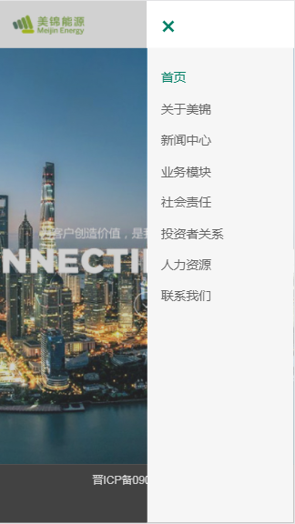
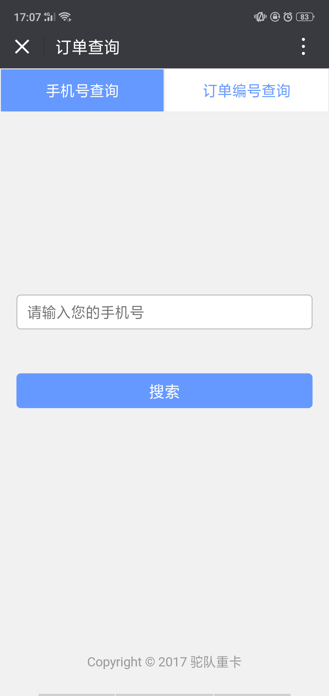

<h3>实际项目经验</h3>
1. 业务数据报表系统：基于VUE、EChart开发的一款报表系统，主要功能是根据搜索信息查询某段时间某个公司的业务数据报表，并且能生成外部链接供系统外的人看。不同于平时VUE开发的单页应用，本次项目中配置了VUE多页应用，更能方便地将系统和普通页面区分开。vue多页应用配置源码地址：[https://github.com/suemuamuamua/vue_multipage ](https://github.com/suemuamuamua/vue_multipage)
2. [美锦能源上市公司官网](http://www.mjenergy.cn)（由于该公司业务原因撤回上线，此处仅展示手机端部分页面）

  
  

3. [榆社远安物流公司官网]（仅PC端）(http://www.ysyawl.com/)

4. 司机微信公众号订单查询（数据敏感，不便链接）

<h3>练手demo集合</h3>
1. [react打造的图片展览（慕课网）](http://smelly.xyz/memory/build/)    (源码地址：https://github.com/suemuamuamua/memory)

2. [七夕快乐（慕课网）](http://smelly.xyz/love-qixi/index.html)    (源码地址：https://github.com/suemuamuamua/love-qixi)

3. [lovely fish小游戏](http://smelly.xyz/lovely-fish/index.html)    (源码地址：https://github.com/suemuamuamua/lovely-fish)

